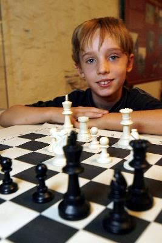
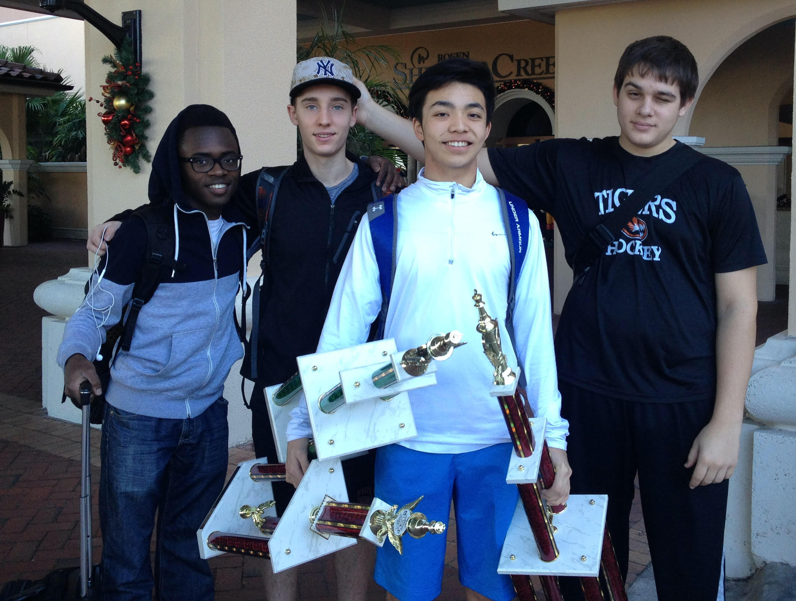
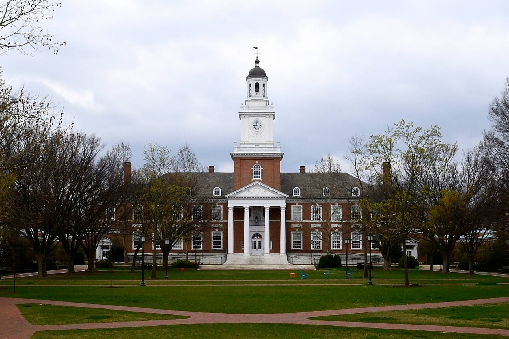

[**Home**](http://michaelainsworth.me){:style="margin-right: 20px;"}
|
[**Work Experience**](http://michaelainsworth.me/workExperience){:style="margin-right: 20px;margin-left: 20px;"}
|
[**Projects**](http://michaelainsworth.me/projects){:style="margin-right: 20px;margin-left: 20px;"}
|
[**Research**](http://michaelainsworth.me/research){:style="margin-right: 20px;margin-left: 20px;"}
|
**Interests**{:style="margin-left: 20px;"}

___

## Interests

I was born and raised in White Plains, New York, just about 30 minutes north of New York City.

Growing up, one of my favorite hobbies was chess. I was taught to play chess at 7 years old, and have been an avid player ever since. Throughout grade school, I travelled all over the country playing in tournaments and competing for my school. I was even nationally ranked, and earned the title of "national expert" at age 12. Some of my favorite memories include traveling to Orlando every winter for the national scholastic chess championships.

{:style="margin-left: 10px; margin-right: 20px; margin-top: 20px; margin-bottom: 10px;"} {:style="margin-right: 20px; margin-top: 20px; margin-bottom: 10px;"}

Once I entered college, I had to cut down on competitive chess due to time restrictions. However, I was still a member of the Johns Hopkins Chess Club and a devoted online chess player. After graduation, one of my goals is to become a chess master and return to tournament play!

Baseball is another one of my long-time interests. As a young kid, my family would often make the trip to Citi Field to watch the Mets (although, I hate to say, I am a Yankees fan at heart). My dad was always my Little League coach, and helped me develop a love for the game. I continued to play baseball through high school and college.

I was fortunate to continue my baseball career at Johns Hopkins University, where I have played for the past 4 years. Hopkins baseball has had some great success, and we even made the 2019 College World Series, in Cedar Rapids, Iowa. Some images can be seen below.

{:style="margin-right: 20px; margin-left: 10px; margin-top: 20px; margin-bottom: 10px;"} {:style="margin-right: 20px; margin-top: 20px; margin-bottom: 20px;"}

Since 2016, I have lived in Baltimore, Maryland in the Charles Village area. While in Baltimore, I enjoy exploring different neighborhoods, trying new restaurants, and attending Ravens and Orioles games. I have always liked the feel of a big city, and would be open to working in new urban areas.

In 2020, I completed my undergraduate degree from Johns Hopkins in Biomedical Engineering with a minor in Mathematics. I returned to Johns Hopkins to complete my graduate degree, and I am expected to graduate in May 2021.

{:style="margin-top: 20px; margin-left: 120px; margin-bottom: 10px;"}

Some of my other hobbies include traveling, hiking, weightlifting, video games, and programming.

 

